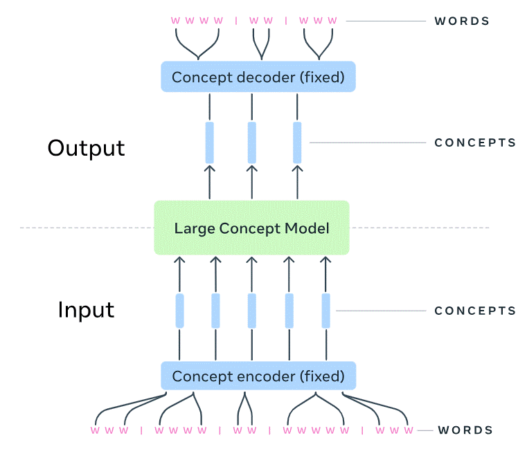
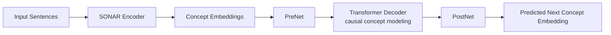
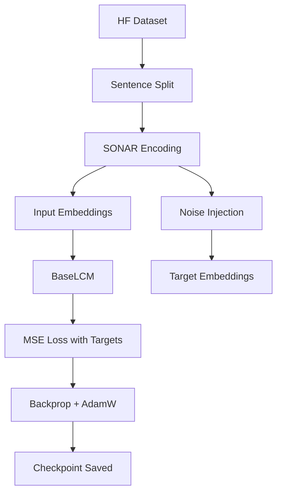

# Small Large Concept Model (LCM)

This repository is a pure, lightweight implementation of a **Large Concept Model-style** pipeline in PyTorch.
It is designed to be **small and fast** (about **5M parameters** in this implementation profile), making it practical for experimentation on limited hardware.

Instead of predicting the next word token directly, the model works in a **sentence-level concept space** (dense embeddings), then learns to predict the next concept representation.

---

## Concept Overview

The core idea is:

1. map text to concept embeddings (sentence vectors),
2. model concept transitions autoregressively,
3. optionally decode or compare predicted concepts downstream.

Your project illustration:



This figure highlights the same high-level design: words are mapped into concept space, the concept model predicts future concepts, and outputs can be mapped back to text-level behavior.

---

## How This Repo Relates to Official LCM

From the official LCM project, the relevant takeaway is that LCMs operate in a **sentence representation space** (SONAR concept space) and can be trained as concept-level sequence models rather than token-level LMs.  
The official work also explores multiple variants (including MSE and diffusion-style approaches) at very large scale.

This repository keeps only the practical, minimal core:

- compact architecture,
- easier training loop,
- faster iteration cycle,
- small parameter budget.

Reference: [facebookresearch/large_concept_model](https://github.com/facebookresearch/large_concept_model)

---

## Why a Small (5M) Concept Model?

- **Fast experimentation:** quicker training and debugging.
- **Lower compute cost:** easier to run on a single GPU or CPU for prototypes.
- **Simple baseline:** clear foundation before scaling to larger concept models.
- **Educational clarity:** code is short enough to inspect end to end.

---

## Architecture at a Glance

Implemented in `src/base_lcm.py`:

- `SonarEncoder`: converts sentences into dense concept embeddings.
- `PreNet`: projects input embedding dimension into model hidden space.
- `TransformerDecoder`: autoregressive concept transition model (causal mask).
- `PostNet`: projects hidden states back to output concept embedding space.
- `BaseLCM`: wraps `PreNet -> TransformerDecoder -> PostNet`.

Diagram:



---

## Training Pipeline

Training logic is in `src/train.py`.

### Steps

1. load text samples from a Hugging Face dataset,
2. split text into sentences with spaCy,
3. encode sentences into concept embeddings (`SonarEncoder`),
4. add controlled noise to create targets,
5. optimize MSE loss between predicted and target concept embeddings,
6. save checkpoint to `saved_models/base_lcm_model.pth`.



---

## Repository Structure

```text
large_concept_model_tt/
├── img/
│   └── LCM.gif
├── src/
│   ├── base_lcm.py
│   ├── train.py
│   ├── test.py
│   └── utils.py
├── saved_models/
├── requirements.txt
└── README.md
```

---

## Installation

Requirements:

- Python 3.12+
- PyTorch-compatible environment (GPU optional, recommended for speed)

Install dependencies:

```bash
pip install -r requirements.txt
python -m spacy download en_core_web_sm
```

---

## Run Training

Minimal example:

```bash
PYTHONPATH=src python -m src.train --hf_data "wikitext" --text_column "text" --data_sample 1000 --epoch 3
```

Extended example:

```bash
PYTHONPATH=src python -m src.train \
  --hf_data "wikitext" \
  --text_column "text" \
  --lang "en" \
  --batch_size 8 \
  --sequence_length 10 \
  --input_dim 256 \
  --hidden_dim 512 \
  --num_heads 8 \
  --num_layers 6 \
  --ff_dim 2048 \
  --output_dim 256 \
  --lr 0.001 \
  --weight_decay 1e-4 \
  --noise_level 0.05 \
  --data_sample 1000
```

Checkpoint output:

```text
saved_models/base_lcm_model.pth
```

---

## Inference / Quick Test

Run:

```bash
PYTHONPATH=src python src/test.py
```

`src/test.py` will:

- load a saved checkpoint,
- infer model config from state dict shapes,
- encode a sample prompt into concept space,
- produce and print predicted concept embedding output.

---

## Results (Template)

Use this section as a lightweight experiment log for reproducibility.

### Training Loss

| Run ID | Dataset | Samples | Epochs | Batch Size | LR | Final Train Loss | Notes |
|---|---|---:|---:|---:|---:|---:|---|
| baseline-001 | wikitext | 1000 | 3 | 8 | 1e-3 | 0.0418 | first stable run |
| exp-002 | wikitext | 2000 | 5 | 8 | 5e-4 | 0.0297 | lower LR + more data improved stability |

### Sample Outputs

| Input Prompt | Expected Semantic Direction | Predicted Output (short) | Comment |
|---|---|---|---|
| "What are the causes of climate change?" | science / environment explanation | _fill from model output_ | check topical coherence |
| "How can I learn Python quickly?" | practical step-by-step advice | _fill from model output_ | check actionable structure |

### Quick Interpretation

- Lower MSE generally indicates better embedding-space reconstruction.
- Also validate semantic quality manually (not just loss), since embedding-space fit does not always guarantee best text-level usefulness.

---

## Optional W&B Logging

Enable in training with:

```bash
--wandb True
```

Then authenticate once:

```bash
wandb login
```

---

## Known Limitations

- **Small model capacity:** the ~5M parameter setup is fast, but may underfit complex long-range concept dynamics.
- **No official benchmark parity:** this repo is a compact educational/experimental implementation, not a reproduction of large-scale LCM training results.
- **Embedding-space objective gap:** MSE on embeddings may not perfectly align with downstream text generation quality.
- **Single checkpoint workflow:** training currently saves one primary checkpoint path (`saved_models/base_lcm_model.pth`) without richer checkpoint management.
- **Device selection behavior:** CUDA device handling in `src/train.py` is hardcoded (`CUDA_VISIBLE_DEVICES="1,2,3"`), which may not match all environments.
- **Data preprocessing simplicity:** sentence splitting and sampling are basic; performance can vary significantly with better curation and preprocessing.

---

## Practical Notes

- `--hf_data` is required for dataset loading.
- Tune `--batch_size` and `--data_sample` for your memory budget.
- The code currently sets `CUDA_VISIBLE_DEVICES="1,2,3"` when CUDA is available.
- This implementation is intentionally compact and optimized for speed and iteration, not for reproducing large-scale training runs.
